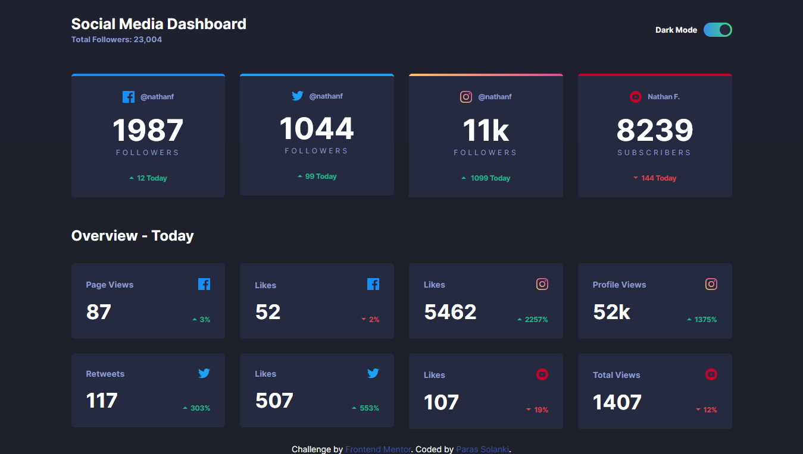
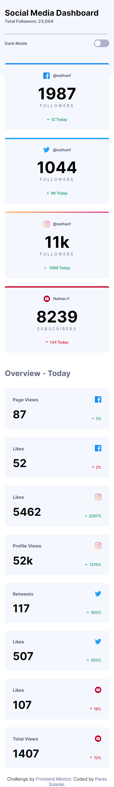
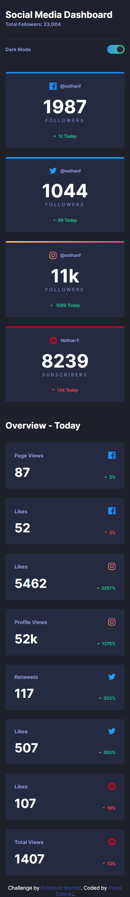

<h1>Frontend Mentor - Social Media Dashboard With Theme Changer</h1>

This is Challenge From <a href="https://www.frontendmentor.io/">Frontend Mentor</a>. The output is as close as possible to design.

<h2>View Page</h2>

To view the website, use the link below

<ul>
    <li><a href="https://parassolanki.github.io/DashBoard-Design/" target="_blank">View Project</a></li>
    <li>With Responsive Design.</li>
    <li>You can change the theme of the design by clicking dark mode button.</li>
</ul>

<h1>Design Images</h1>

<table>
    <tr>
        <th>Desktop Design With Light Mode</th>
        <th>Desktop Design With Dark Mode</th>
    </tr>
    <tr>
        <td></td>
        <td></td>
    </tr>
</tr>
</table>

<table>
    <tr>
        <th>Mobile Design With Light Mode</th>
        <th>Mobile Design With Dark Mode</th>
    </tr>
    <tr>
        <td></td>
        <td></td>
    </tr>
</tr>
</table>
