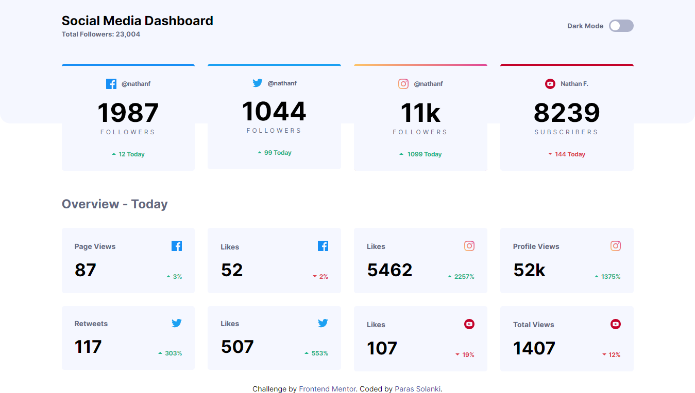

<h1>Frontend Mentor - Social Media Dashboard With Theme Changer</h1>

This is Challenge From <a href="https://www.frontendmentor.io/">Frontend Mentor</a>. The output is as close as possible to design.

<h2>View Page</h2>

To view the website, use the link below

<ul>
    <li></li>
    <li>With Responsive Design.</li>
    <li>You can change the theme of the design by clicking dark mode button.</li>
</ul>

<h2>Design Images</h2>

<h4>Desktop Design With Light Mode</h4>

<h4>Desktop Design With Dark Mode</h4>

